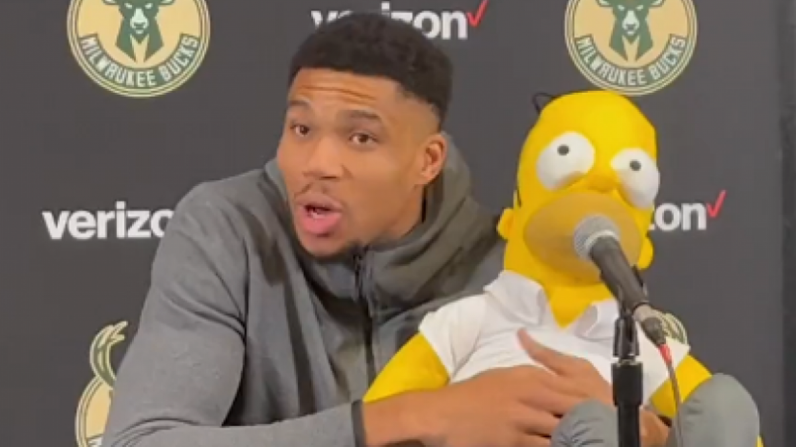
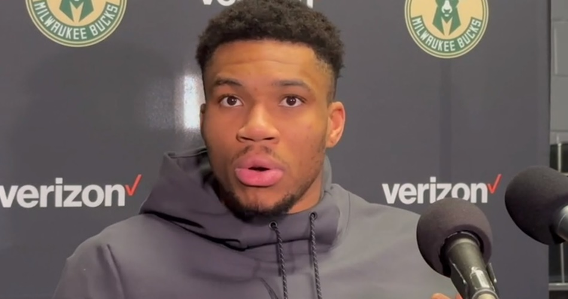

# **Nathan's User Page**

# **Table Of Contents**
- [**Nathan's User Page**](#nathans-user-page)
- [**Table Of Contents**](#table-of-contents)
  - [**My favorite quote currently:**](#my-favorite-quote-currently)
  - [Favorite Youtuber currently:](#favorite-youtuber-currently)
  - [**Favorite Chess Players:**](#favorite-chess-players)
  - [**Favorite NBA Players:**](#favorite-nba-players)
  - [**Goals in life:**](#goals-in-life)
  - [**For loop in C++**](#for-loop-in-c)

## **My favorite quote currently:**
> *“Would I rather be feared or loved? Easy. Both. I want people to be afraid of how much they love me.” -Michael Scott*

## Favorite Youtuber currently:
- My favorite youtuber is [busy dad training](https://www.youtube.com/@busydadtraining) because he was my CAT TA last quarter.

My a close second would be [GothamChess](https://www.youtube.com/@GothamChess) because I enjoy watching chess videos.

## **Favorite Chess Players:**
1. Levy Rozman
2. Magnus Carlsen
3. Hikaru Nakamura
4. Hans Niemann
5. Bobby Fischer

In addition to watching chess, I also enjoy watching basketball games. Here are a few of my favorite NBA players.

## **Favorite NBA Players:**
- Stephen Curry
- **Giannis Antetokounmpo**
- LeBron James
- Ja Morant
- Patrick Beverley

## **Goals in life:**
- [ ] Become a Chess Grandmaster
- [ ] Dunk a Basketball
- [ ] Run a marathon
- [ ] Learn to surf
- [ ] Become a black belt in Taekwon-Do
- [X] Go to a Warriors Game
- [X] Get into college

## **For loop in C++**
```
for(int i = 0; i < arr.size(); i++) {
    if(arr[i] % 2 == 0) {
        cout << arr[i] << endl;
    }
}
```

**Click [here](pics/GiannisShimmy.jpg) to see an immaculate picture of Giannis doing the shimmy**

**Click [here](README.md) to go back to the README.md**

**Click [here](#nathans-user-page) to go back to the top of the page**

